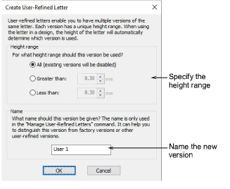
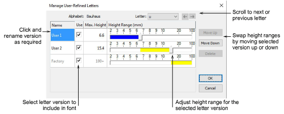

# Create user-refined letters

Sometimes you find that you want to reshape a letter to improve its appearance, perhaps to suit a particular lettering height. EmbroideryStudio lets you save the letter as an alternative version. In fact you can save multiple versions of the same letter within the same font. Each version can have a unique height range. When using the letter in a design, the height setting will automatically determine which version is used. The feature thereby allows you to permanently record fixes to particular lettering problems and thereafter automatically apply them.

User-refined letters are managed via the Manage User-Refined Letters option. This menu item is only enabled when a lettering object with a font containing user-refined letters is currently selected.

## Related video

<iframe src="https://www.youtube.com/embed/t_cKBLsU04I" frameborder="0" 
		 allow="accelerometer; autoplay; encrypted-media; gyroscope; picture-in-picture" 
		 allowfullscreen="" style="width: 560px; height: 315px;">

&#160;

</iframe>

## Related topics

- [Save user-refined letters](../../Lettering/lettering_custom/Save_user-refined_letters)
- [Manage user-refined letters](../../Lettering/lettering_custom/Manage_user-refined_letters)
