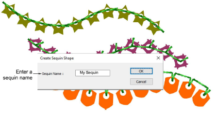
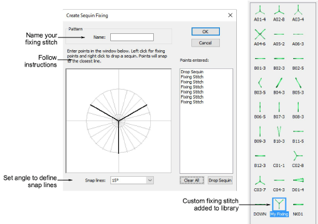

# Custom sequins

EmbroideryStudio supports custom sequin shapes with offset holes. Define your own sequins using circle, oval, rectangle, or other shapes.

Just as you can define custom sequin shapes, you can define custom fixing stitches to support multi-head sequin devices. Access the dialog via the Object > Create Sequin Fixing command.

## Related topics

- [Custom sequins](../../Applied/sequin_advanced/Custom_sequins)
