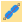
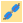
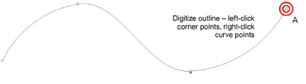
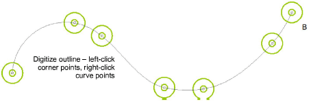

# Digitize bead runs

|      | Use Bead > Bead Run Auto to create a string of beads along a digitized line according to current settings. |                                                                                                      |
| ---------------------------------------------- | ---------------------------------------------------------------------------------------------------------- | ---------------------------------------------------------------------------------------------------- |
|  | Use Bead > Bead Run Manual to manually digitize bead-drops along a digitized line.                         |                                                                                                      |
|      |                                                                                                            | Use Bead > Bead Palette to select from a user-defined palette of bead shapes for the current design. |

Normally beads are stitched last, after motifs and other embroidery are complete. With the Bead Run tools you have the option of digitizing individual bead drops or letting the system generate them for you. Automatic bead runs can be scaled. To digitize a scalable bead run, use the Bead Run Auto tool. Enter reference points – left-click for corner points, right-click for curve points.

Alternatively, to control the exact placement of your bead drops, use the Bead Run Manual tool. Digitize individual bead drops with left and right mouse-clicks.

## Related video

<iframe src="https://www.youtube.com/embed/jjXFmGF6HEE" title="YouTube video player" 
		 frameborder="0" allow="accelerometer; autoplay; clipboard-write; encrypted-media; gyroscope; picture-in-picture" 
		 allowfullscreen="" style="width: 560px; height: 315px;">

&#160;

</iframe>

## Related topics

- [Beading mode](../../Applied/beading/Beading_mode)
- [Creating bead runs](../../Applied/beading/Creating_bead_runs)
