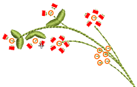

# Digitize manual bead drops

|  | Use Bead > Manual Bead to digitize individual beads. |
| ---------------------------------------- | ---------------------------------------------------- |

The Manual Bead input method allows you individual control over bead placement and fixing stitches. Create decorative bead placements or ‘clusters’ using beads from the palette. To add a bead to the stitching sequence, simply drop it onto the design and secure it with manual stitches.

::: info Note
Manual bead stitching is a difficult digitizing skill to master and you need to plan the stitching sequence carefully in order to minimize unnecessary stitches. Experiment with your machine and stitch length and spacing settings to achieve the desired result.
:::

## Related topics

- [Beading mode](../../Applied/beading/Beading_mode)
- [Digitize manual bead drops](../../Applied/beading/Digitize_manual_bead_drops)
