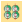
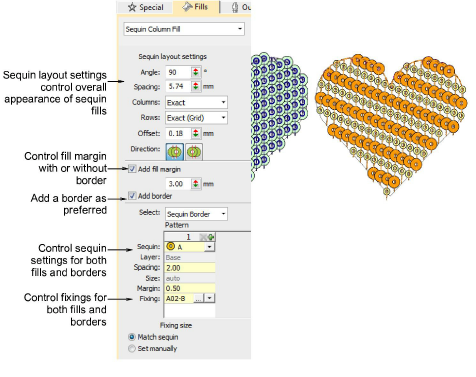

# Digitize sequin fills

|  | Use Sequin > Sequin Fill to digitize and fill large, irregular shapes with sequins. |
| ---------------------------------------- | ----------------------------------------------------------------------------------- |

The Sequin Fill feature provides a means of filling complex shapes with sequins arranged in columns. The fill can also include a border, with or without a margin. This can be made from the same or a different sequin and is a property of the object.

Sequin fills are tied together by run stitches and travel runs. Travels are placed along the object outline. Sequin centers never fall outside the object outline. Sequin fixing stitches, however, can lie outside the outline depending on current settings.

## Related video

<iframe src="https://www.youtube.com/embed/R2vM59mkNYg" frameborder="0" 
		 allow="accelerometer; autoplay; encrypted-media; gyroscope; picture-in-picture" 
		 allowfullscreen="" style="width: 560px; height: 315px;">

&#160;

</iframe>

## Related topics

- [Digitize sequin fills](../../Applied/sequin_advanced/Digitize_sequin_fills)
- [Adjust sequin layouts](../../Applied/sequin_advanced/Adjust_sequin_layouts)
- [Fancy sequin fills](../../Applied/sequin_advanced/Fancy_sequin_fills)
- [Convert embroidery objects to sequins](../../Applied/sequin_advanced/Convert_embroidery_objects_to_sequins)
- [Creating free-form shapes](../../Digitizing/input/Creating_free-form_shapes)
