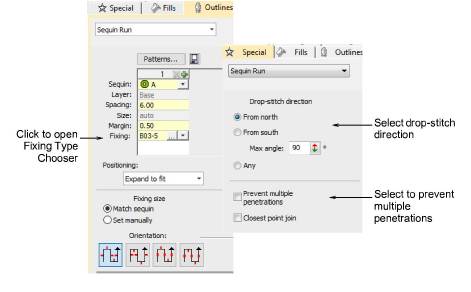

# Digitize sequin runs

|      | Use Sequin > Sequin Run Auto to create a string of sequins along a digitized line according to current settings. |
| -------------------------------------------------- | ---------------------------------------------------------------------------------------------------------------- |
|  | Use Sequin > Sequin Run Manual to manually digitize sequin-drops along a digitized line.                         |

Create sequin runs along digitized lines, either placing sequins manually or letting the software generate placement positions according to current settings. You have the choice of exact spacing, for open shapes, or even spacing, for closed shapes. You can preset sequin type or change at any stage.

There is an option to ensure that the initial fixing stitch before the sequin drop is placed opposite the feeding direction, as recommended by the machine manufacturer. Otherwise, the sequin may be deflected by the thread. If the needle then misses the center of the sequin because of incorrect placement, the embroidery material, needle or needle plates may be damaged. In multihead machines, sequins are fed from the front or ‘south’ which means that the initial fixing stitch or ‘drop stitch’ should be placed on the ‘north’ side (the default). In Schiffli machines, the opposite is the case.

## Related video

<iframe src="https://www.youtube.com/embed/R2vM59mkNYg" frameborder="0" 
		 allow="accelerometer; autoplay; encrypted-media; gyroscope; picture-in-picture" 
		 allowfullscreen="" style="width: 560px; height: 315px;">

</iframe>

## Related topics

- [Access object properties](../../Basics/basics/Access_object_properties)
- [Digitizing sequin runs](../../Applied/sequin_basics/Digitizing_sequin_runs)
- [Apply sequin fixings](../../Applied/sequin_basics/Apply_sequin_fixings)
- [Set drop-stitch direction](../../Applied/sequin_basics/Set_drop-stitch_direction)
