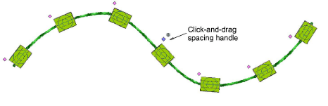

# Edit bead runs

|  | Use Bead > Bead Edit to fine-tune placement of individual beads. |
| ------------------------------------ | ---------------------------------------------------------------- |

Fine-tune individual bead spacings with the Bead Edit tool. Click-and-drag a diamond [control point](../../glossary/glossary). Hold down Shift or Ctrl keys to select a range or multiple control points.

You have complete control over editing bead-run objects, from scaling to adding or removing individual beads. You can also manually fine-tune bead spacing and orienation. You can even edit individual fixing stitches.

## Related topics

- [Beading mode](../../Applied/beading/Beading_mode)
- [Editing bead runs](../../Applied/beading/Editing_bead_runs)
