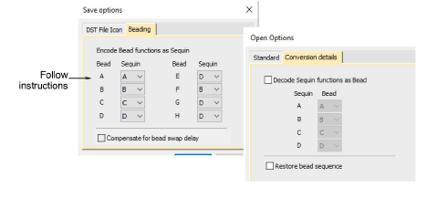

# Encode bead drops on output

While an explicit Drop Bead function exists in the software for bead digitizing, beading-specific machine functions do not exist in DST, DHA, DHB and DHP formats. Instead, sequin functions are used. You can control encoding of bead functions on output via the Save Options dialog. This is available when you export as Tajima DST with Dahao machine format selected in your design.

Because beading-specific machine functions do not exist in DST, DHA, DHB and DHP formats, the Open Options dialog allows you to decode sequin functions as beading when opening these formats using Dahao target machine.

## Related topics

- [Beading mode](../../Applied/beading/Beading_mode)
- [Bead encoding & decoding](../../Applied/beading/Bead_encoding_decoding)
