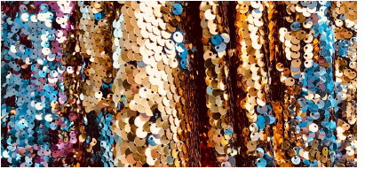

# Flip sequins

|  | Use View > Flip Sequins to toggle between front and reverse sides of sequin runs and fills in reversible sequin designs. Define colors in the Sequin Palette Editor. |
| ------------------------------------------ | -------------------------------------------------------------------------------------------------------------------------------------------------------------------- |

Flip sequins, also known as reversible sequins, create a color-changing effect which is very fashionable. Beginning with children’s wear, flip sequins have found a wide variety of applications, from reversible sequin shirts, pillow cases, bags, cases, note books, and more. Their use is simple – swipe up or down to reveal the reverse side with sometimes surprising effects. Flip sequins have also found their way into high fashion.

## Related video

<iframe src="https://www.youtube.com/embed/ZECDDSdZ1Bo" frameborder="0" 
		 allow="accelerometer; autoplay; encrypted-media; gyroscope; picture-in-picture" 
		 allowfullscreen="" style="width: 560px; height: 315px;">

&#160;

</iframe>

## Related topics

- [Visualizing sequin designs](../../Applied/sequin_basics/Visualizing_sequin_designs)
