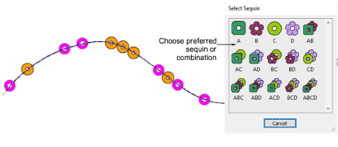

# Insert sequins while traveling

|        | Use Sequin > Drop Sequin to drop a sequin at the current needle position. For twin-sequin machines, left-click to drop a left-sequin, right-click to drop a right-sequin. |
| ---------------------------------------------- | ------------------------------------------------------------------------------------------------------------------------------------------------------------------------- |
|  | Use Sequin > Clear Function to remove any sequin functions from the current needle position.                                                                              |

In preference to the Manual Sequin tool, some users prefer to flesh out a design using Run or Triple Run stitching and then travel through it, dropping sequins manually as and where required. This technique can be used with single or twin sequins.

From the Insert Function dialog, select Drop Sequin. Depending on machine requirements, you will either add the function to the current stitch, or insert it on an [empty stitch](../../glossary/glossary#empty-stitch) or [empty jump](../../glossary/glossary#empty-jump). See your machine manual for details. When the Drop Sequin function is correctly defined, click OK. The Select Sequin dialog opens showing available sequins.

## Related topics

- [Insert sequin drops](../../Applied/sequin_advanced/Insert_sequin_drops)
