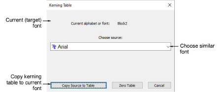

# Kerning table

A kerning table is an array of kerning values for every possible pair of letters in the font. The Kerning Table command accesses a dialog used to manage kerning tables. You can copy tables from one embroidery or TrueType font to another embroidery font or remove its kerning table altogether.

## Related video

<iframe src="https://www.youtube.com/embed/R_0M5cImKUU" frameborder="0" 
		 allow="accelerometer; autoplay; encrypted-media; gyroscope; picture-in-picture" 
		 allowfullscreen="" style="width: 560px; height: 315px;">

</iframe>

## Related topics

- [Managing kerning tables](..\..\Lettering\lettering advanced\Managing_kerning_tables)
