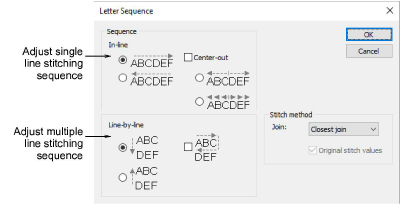

# Letter sequence

The Letter Sequence dialog lets you specify the stitching sequence of letters and lines in a lettering object to minimize registration problems when stitching out.

## Related topics

- [Adjust letter sequencing](../../Lettering/lettering_advanced/Adjust_letter_sequencing)
- [Change lettering join method](../../Lettering/lettering_advanced/Change_lettering_join_method)
