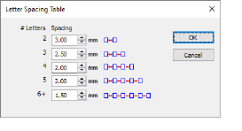

# Letter spacing table

The Letter Spacing Table feature allows you to fine-tune letter spacing according to the number of characters per lettering object. When activated, EmbroideryStudio automatically spaces letters according to a predefined spacing table. For example, in a five-character lettering object, spacing may be set to 2mm, while in a three-character lettering object, it may be increased to, say, 3mm.

## Related topics

- [Setting automatic letter spacing](../../Lettering/lettering_advanced/Setting_automatic_letter_spacing)
