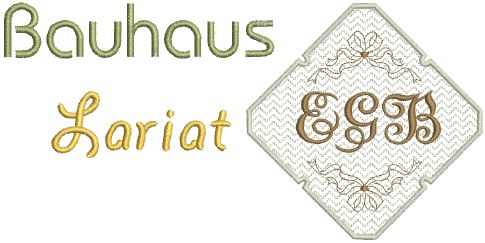

# Lettering

The Lettering toolbar contains a complete set of tools for the creation of lettering, monogramming and team lettering designs.

## Related video

<iframe src="https://www.youtube.com/embed/ntNNpkf1LfM" frameborder="0" 
		 allow="accelerometer; autoplay; encrypted-media; gyroscope; picture-in-picture" 
		 allowfullscreen="" style="width: 560px; height: 315px;">

&#160;

</iframe>

## Related video

<iframe src="https://www.youtube.com/embed/mX_gktu44vU" frameborder="0" 
		 allow="accelerometer; autoplay; encrypted-media; gyroscope; picture-in-picture" 
		 allowfullscreen="" style="width: 560px; height: 315px;">

&#160;

</iframe>

## Related video

<iframe src="https://www.youtube.com/embed/MPW0jdWvmUs" frameborder="0" 
		 allow="accelerometer; autoplay; encrypted-media; gyroscope; picture-in-picture" 
		 allowfullscreen="" style="width: 560px; height: 315px;">

&#160;

</iframe>

## Related topics

- [Create lettering in CorelDRAW Graphics](Create_lettering_in_CorelDRAW_Graphics)
- [Add embroidery lettering](Add_embroidery_lettering)
- [Baseline settings](Baseline_settings)
- [Insert symbols](Insert_symbols)
- [Letter spacing table](Letter_spacing_table)
- [Letter sequence](Letter_sequence)
- [Convert TrueType font](Convert_TrueType_font)
- [Conversion settings](Conversion_settings)
- [Kerning table](Kerning_table)
- [Create alphabet](Create_alphabet)
- [Create letter](Create_letter)
- [Manage alphabets](Manage_alphabets)
- [Create user-refined letter](Create_user-refined_letter)
- [Manage user-refined lettering](Manage_user-refined_lettering)
