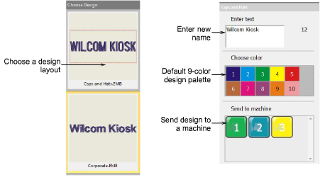
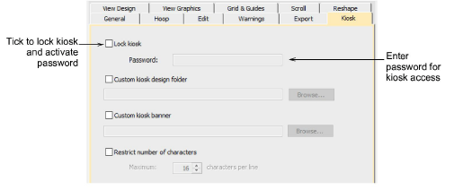
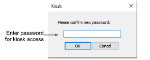

# Lettering kiosk

The lettering kiosk provides a set of predefined design layouts and the ability to easily personalize them by modifying text and color. You can create your own layouts as well. Designs can be sent to machine from the kiosk via a single button press. The Choose Design panel is positioned on the left side. It contains a set of predefined design layouts to choose from. More designs can be added.

The customization panel on the right allows the operator to easily customize designs by changing color and text of the selected layout. The supervisor can pre-configure the number and values of standard colors to match the thread color setup on the machines. Custom designs can be sent to one of several attached embroidery machines.

## Kiosk options

When first running EmbroideryStudio e4, supervisors have access to EmbroideryStudio operations. In this mode, they can use the full range of software capabilities to fine-tune settings.

## Kiosk password

Supervisors can lock the kiosk to protect against unauthorized use. They can later temporarily unlock the kiosk in order to edit designs or change other settings.

## Related video

<iframe src="https://www.youtube.com/embed/MCga_492XhM" frameborder="0" 
		 allow="accelerometer; autoplay; encrypted-media; gyroscope; picture-in-picture" 
		 allowfullscreen="" style="width: 560px; height: 315px;">

&#160;

</iframe>

## Related video

<iframe src="https://www.youtube.com/embed/vfbXK4Umezg" frameborder="0" 
		 allow="accelerometer; autoplay; encrypted-media; gyroscope; picture-in-picture" 
		 allowfullscreen="" style="width: 560px; height: 315px;">

&#160;

</iframe>

## Related topics

- [Normal Kiosk operation](../../Lettering/lettering_kiosk/Normal_Kiosk_operation)
- [Create kiosk passwords](../../Lettering/lettering_kiosk/Create_kiosk_passwords)
- [Configuration options for supervisors](../../Lettering/lettering_kiosk/Configuration_options_for_supervisors)
