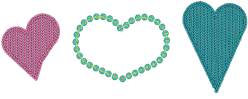

# Modify sequin designs

|  | Use Sequin > Sequin Edit to fine-tune placement of individual sequins. |
| ---------------------------------------- | ---------------------------------------------------------------------- |

You have complete control over scaling and reshaping sequin-run objects. Scale and reshape sequin run lines, as well as remove or add individual sequins. You can also manually fine-tune sequin spacings. You can even edit individual fixing stitches.

Either by means of object properties or the Reshape Object tool, you can control the overall shape of sequin fills as well as their layout. You can also set entry and exit points to avoid excessive needle penetrations.

## Related topics

- [Editing sequin runs](../../Applied/sequin_basics/Editing_sequin_runs)
- [Editing sequin fills](../../Applied/sequin_advanced/Editing_sequin_fills)
