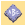
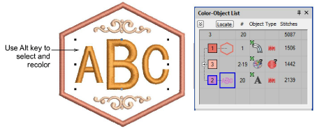
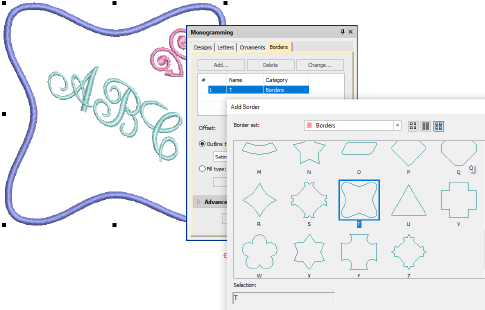

# Monogramming

|  | Use Toolbox > Monogramming to create personalized monograms using a selection of predefined monogramming styles, border shapes and ornaments. |
| -------------------------------------------- | --------------------------------------------------------------------------------------------------------------------------------------------- |

The Monogramming feature offers a simple way to create personalized monograms using a selection of predefined monogramming styles, border shapes and ornaments, together with a set of tools to help you place these elements in creative and decorative ways.

## Monogram borders

If you are using one of the template designs, it is a simple matter to change borders. Use the Change button on the Borders tab to select from one of the many available.

## Related video

<iframe src="https://www.youtube.com/embed/HuhkfGYp30s" frameborder="0" 
		 allow="accelerometer; autoplay; encrypted-media; gyroscope; picture-in-picture" 
		 allowfullscreen="" style="width: 560px; height: 315px;">

</iframe>

## Related topics

- [Monogram designs](../../Lettering/lettering_monograms/Monogram_designs)
- [Monogram lettering](../../Lettering/lettering_monograms/Monogram_lettering)
- [Monogram ornaments](../../Lettering/lettering_monograms/Monogram_ornaments)
- [Monogram borders](../../Lettering/lettering_monograms/Monogram_borders)
