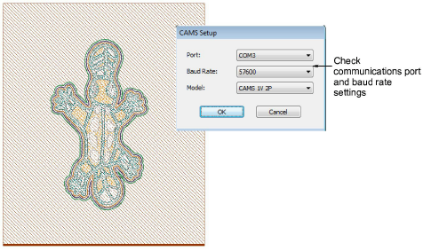
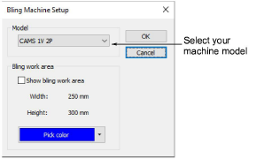

# Output directly to CAMS machine

|  | Use Bling > Show Bling Work Area to visualize the design within the work area of the selected machine model. |
| ------------------------------------------------------ | ------------------------------------------------------------------------------------------------------------ |

EmbroideryStudio supports direct connection to CAMS automatic rhinestone placement machines.

## Bling machine setup

EmbroideryStudio supports direct connection to CAMS automatic rhinestone placement machines.

Note: Before executing the procedure, it is important that the machine drivers for your CAMS machine be properly installed. They need to be installed and the machine connected before setting up the COM port. Refer to your machine documentation.

## Related topics

- [Bling production processes](../../Applied/bling/Bling_production_processes)
- [Digitize bling runs](../../Applied/bling/Digitize_bling_runs)
- [Create bling fills](../../Applied/bling/Create_bling_fills)
- [Outputting bling for production](../../Applied/export/Outputting_bling_for_production)
- [Send bling to CAMS machine](../../Applied/export/Send_bling_to_CAMS_machine)
