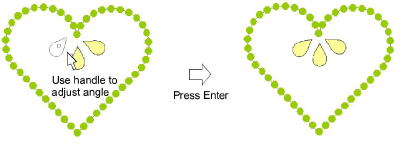

# Place individual rhinestones

|  | Use Bling > Bling Manual to digitize individual bling drops. Select from a user-defined palette of rhinestone shapes. |
| ------------------------------------------ | --------------------------------------------------------------------------------------------------------------------- |

You have the option of digitizing individual rhinestone ‘drops’ with the manual method.

## Related topics

- [Bling production processes](../../Applied/bling/Bling_production_processes)
- [Place rhinestones manually](../../Applied/bling/Place_rhinestones_manually)
