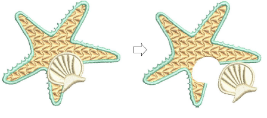
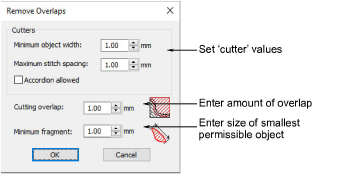

# Remove underlying stitching

|  | Use Appliqué > Remove Overlaps to remove underlying layer of stitching in overlapping objects. |
| ------------------------------------------------ | ---------------------------------------------------------------------------------------------- |

Use the Remove Overlaps command to remove underlying stitching in overlapping objects. This helps to reduce stitch count and prevent a build-up of stitches.

Use the Remove Overlaps feature to maintain shapes but remove the underlying layer of stitching.

## Related topics

- [Removing underlying stitching](../../Quality/quality/Removing_underlying_stitching)
