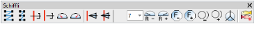
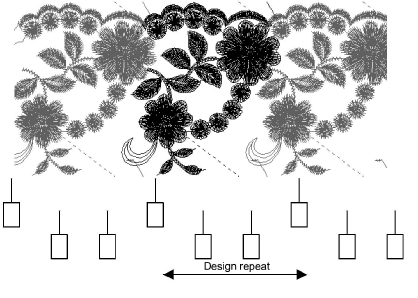

# Schiffli

EmbroideryStudio provides an option in support of a wide range of Schiffli work.

The Schiffli option includes support for:

- Design repeats
- Thread Tension and Speed Change functions
- Borer operations
- All Plauen (T10) and Saurer (T15) functions
- Direct reading/writing Hiraoka DAT and Saurer SAS formats
- Pattern arrangements
- RCC designs
- Direct reading/writing of high resolution [ESS](../../glossary/glossary) format, accessible to DesignWorkflow.

With Schiffli you can view any number of full or part repeats to see how they inter-connect. A Print Repeats function for the Production Worksheet is available so your customers don’t need to wait for design samples.

You can also save digitizing time with pattern (ABC) arrangements. Pattern arrangements mean that only the design elements to be repeated are digitized. The design file contains only the information needed to show how the design is to be repeated or mirrored.

The Schiffli borer operation includes full support for various machines, including borer depth control and the automatic creation of the appropriate machine control sequence (fast/slow, needles in/out, etc). These functions are also supported with digitizing tablet functionality so that users with traditional enlargement drawings also can utilize them.

## Schiffli supplement

For further information about the Schiffli tools, please refer to the Schiffli Supplement supplied with the Schiffli option. This is available via the Help menu. It documents:

- Schiffli features within EmbroideryStudio
- Read/output to Schiffli files
- Schiffli disk utilities, Fixpat, Defced.
