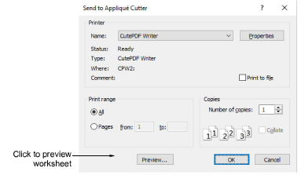

# Send to appliqué cutter

|  | Use Standard > Send to Appliqué Cutter to send appliqué shapes from design file to laser cutter. |
| ------------------------------------------------------------ | ------------------------------------------------------------------------------------------------ |

EmbroideryStudio can extract outlines from a design and send them to a laser cutter. This procedure is employed when the cutter is supported directly by a MS Windows® driver. Only shapes defining the actual appliqué fabric are sent.

::: info Note
Before you send appliqué shapes to a cutter, make sure it is set up on your system with the correct MS Windows® (printer) driver. Some cutters – e.g. Ioline – use a standard driver for HP-7475 plotters. Once the driver is installed in MS Windows®, there is no need for a separate hardware setup in EmbroideryStudio.
:::

## Related topics

- [Exporting multiple decoration files](../../Applied/export/Exporting_multiple_decoration_files)
- [Cut appliqué shapes](../../Applied/export/Cut_appliqué_shapes)
