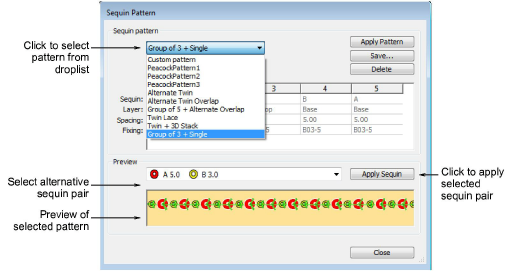

# Sequin patterns

Change patterns applying to twin-sequin runs like any other object properties. You can apply current properties to selected objects, apply other sequin pairs, and/or different patterns. You can even define you own patterns.

## Related video

<iframe src="https://www.youtube.com/embed/oVx8J8b4Z8k" frameborder="0" 
		 allow="accelerometer; autoplay; encrypted-media; gyroscope; picture-in-picture" 
		 allowfullscreen="" style="width: 560px; height: 315px;">

&#160;

</iframe>

## Related topics

- [Apply multi-sequin run patterns](..\..\Mixed\sequin basics\Apply_multi-sequin_run_patterns)
- [Create multi-sequin run patterns](..\..\Mixed\sequin basics\Create_multi-sequin_run_patterns)
- [Creating multi-sequin fills](..\..\Mixed\sequin advanced\Creating_multi-sequin_fills)
