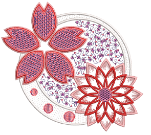

# Sequins

Some embroidery machines are equipped with a sequin dispenser that drops sequins onto the garment as it stitches. Some are also equipped with a boring knife or needle to cut holes in the fabric, producing an effect similar to lace. Often the two techniques are used in combination. EmbroideryStudio provides a dedicated set of sequin tools which allow you to digitize sequined designs for compatible machines.

## Related video

<iframe src="https://www.youtube.com/embed/R2vM59mkNYg" frameborder="0" 
		 allow="accelerometer; autoplay; encrypted-media; gyroscope; picture-in-picture" 
		 allowfullscreen="" style="width: 560px; height: 315px;">

&#160;

</iframe>

## Related topics

- [Set up sequin palettes](Set_up_sequin_palettes)
- [Change sequins & fixing stitches](Change_sequins_fixing_stitches)
- [Manually digitize sequin drops](Manually_digitize_sequin_drops)
- [Digitize sequin runs](Digitize_sequin_runs)
- [Digitize sequin fills](Digitize_sequin_fills)
- [Flip sequins](Flip_sequins)
- [Modify sequin designs](Modify_sequin_designs)
- [Convert sequin artwork](Convert_sequin_artwork)
- [Digitize sequin drops while traveling](Digitize_sequin_drops_while_traveling)
- [Sequin patterns](Sequin_patterns)
- [Custom sequins](Custom_sequins)
- [Twin Device - Select Sequin](Twin_Device_-_Select_Sequin)
