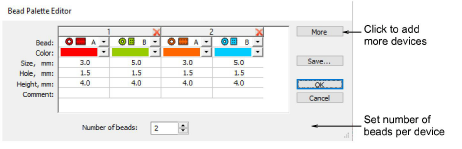

# Set up bead palette

|  | Use Bead > Bead Palette Editor to select shapes from a bead library, and define bead colors and sizes. |
| ------------------------------------------------------ | ------------------------------------------------------------------------------------------------------ |

Use the Bead Palette Editor to prepare a palette of beads for use according to your machine capabilities. Bead devices are normally attached to the first or last needle of the machine head.

## Related topics

- [Beading mode](../../Applied/beading/Beading_mode)
- [Set up bead palette](../../Applied/beading/Set_up_bead_palette)
