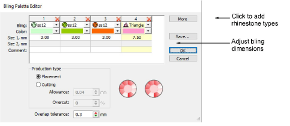

# Set up bling palettes

|  | Use Bling > Bling Palette Editor to select and configure shapes from a pattern library. |
| -------------------------------------------------------- | --------------------------------------------------------------------------------------- |

The Bling Palette Editor lets you prepare a palette of rhinestones for use in the current design. Once set up, the palette is available for use in Object Properties or from the Bling toolbar.

## Related topics

- [Bling production processes](../../Applied/bling/Bling_production_processes)
- [Setting up bling palettes](../../Applied/bling/Setting_up_bling_palettes)
