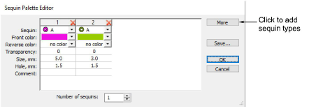

# Set up sequin palettes

|  | Use Sequin > Sequin Palette Editor to select shapes from a sequin library. |
| ---------------------------------------------------------- | -------------------------------------------------------------------------- |

The Sequin Palette Editor lets you prepare a palette of sequins to use in your design. Set color and size for each sequin, as well as sequin hole size. Once set up, the palette is available for use from the Sequin Palette droplist.

## Related topics

- [Setting up sequin palettes](../../Applied/sequin_basics/Setting_up_sequin_palettes)
- [Creating multi-sequin runs](../../Applied/sequin_basics/Creating_multi-sequin_runs)
