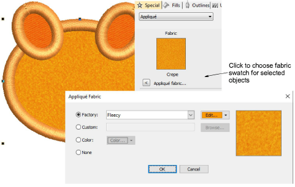

# Show appliqué fabric

|  | Use View > Show Appliqué Fabric to toggle the appliqué fabric display on/off. |
| -------------------------------------------------------- | ----------------------------------------------------------------------------- |

EmbroideryStudio lets you select a fabric swatch for appliqué objects. The swatch becomes a property of the object. Choose from amongst the included ‘factory’ swatches or choose a scanned sample of the fabric you want to use. Use the Show Appliqué Fabric toggle to turn it on or off.

## Related topics

- [View graphical components](../../Basics/view/View_graphical_components)
- [Appliqué Embroidery](../../Applied/applique/Appliqué_Embroidery)
