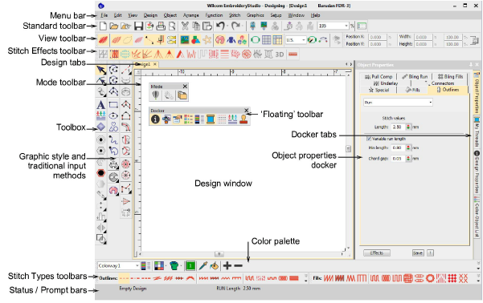

# Speciality Features

You can access commands using buttons on the toolbars of your design window. To use a tool, simply move the mouse pointer over it, and click with the left mouse button.

## Related topics

- [Lettering](Lettering)
- [Teamname lettering](Teamname_lettering)
- [Monogramming](Monogramming)
- [Lettering kiosk](Lettering_kiosk)
- [Appliqué](Appliqué)
- [Cording](Cording)
- [Sequins](Sequins)
- [Beading](Beading)
- [Bling](Bling)
- [Chenille](Chenille)
- [Schiffli](Schiffli)
