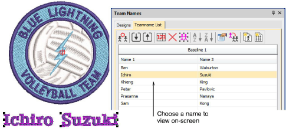

# Team names

|            | Use Teamname List > Manage Teams to manage teams and team members for future use.                                                                     |
| ---------------------------------------------------- | ----------------------------------------------------------------------------------------------------------------------------------------------------- |
|        | Use Teamname List > Import/Export Team Members to import or export a list of team members in either TXT or CSV format. Names must be comma delimited. |
|        |                                                                                                                                                       |
|                | Use Teamname List > Name Order to change default naming order or include/exclude names as required.                                                   |
|                      | Use Teamname List > Remove Selected to delete selected rows or the entire member list.                                                                |
|                | Use Teamname List > Select All to selected all list members for modification or positioning.                                                          |
|        | Use Teamname List > Sort Ascending/Descending to sort a selected column of names in ascending or descending order.                                    |
|      |                                                                                                                                                       |
|  | Use Teamname List > Object Properties to edit properties of selected rows, columns or all list members.                                               |
|              | Use Teamname List > Apply To All to copy properties to all team members.                                                                              |
|        | Use Teamname List > Create Designs to create individual designs for each team member.                                                                 |
|      | Use Teamname List > Teamname Matrix to automatically create a matrix of all names in a teamname object together with their corresponding design.      |

You can preview individual team names in the design window as they will be stitched out with the design. Use the Teamname List tools to add names, delete names, sort team lists, change properties of some or all team members.

## Related video

<iframe src="https://www.youtube.com/embed/VxwJBzjXmIA" frameborder="0" 
		 allow="accelerometer; autoplay; encrypted-media; gyroscope; picture-in-picture" 
		 allowfullscreen="" style="width: 560px; height: 315px;">

&#160;

</iframe>

## Related topics

- [Team Names](../../Lettering/lettering_names/Team_Names)
- [Creating simple teamname designs](../../Lettering/lettering_names/Creating_simple_teamname_designs)
- [Modifying teamname designs](../../Lettering/lettering_names/Modifying_teamname_designs)
- [Creating separate designs](..\..\Lettering\lettering names\Creating_separate_designs)
- [Creating a matrix of designs](..\..\Lettering\lettering names\Creating_a_matrix_of_designs)
