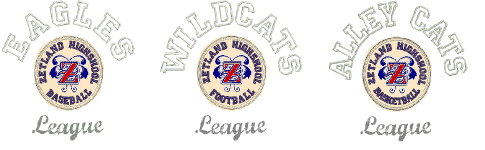

# Teamname lettering

|        | Use Toolbox > Team Names to associate multiple names with a design.                                           |
| -------------------------------------------- | ------------------------------------------------------------------------------------------------------------- |
|  | Use Docker > Team Names to toggle team members display on/off. Use it to view and edit individual team names. |

The Team Names feature lets you create designs with multiple names. For example, you can use the same logo with different names for sports teams or corporate uniforms, without having to create multiple copies of the same design. Depending on how you want to stitch out, you can choose to save and stitch names and designs separately, or together.

## Related video

<iframe src="https://www.youtube.com/embed/vgyg0vTPfFk" frameborder="0" 
		 allow="accelerometer; autoplay; encrypted-media; gyroscope; picture-in-picture" 
		 allowfullscreen="" style="width: 560px; height: 315px;">

</iframe>

## Related topics

- [Team names](Team_names)
- [Teamname setup](Teamname_setup)
- [Teamname matrix](Teamname_matrix)
- [Teamname save options](Teamname_save_options)
