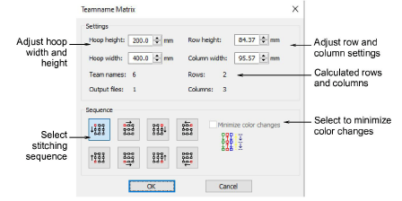

# Teamname matrix

The Teamnames Matrix feature allows you to automatically create a matrix for all names in a team name object together with their corresponding design. You have the option to minimize the number of color changes created by the matrix operation. The operation also attempts to minimize the number of jumps. A team name object must be present in the design to activate the feature.

## Related video

<iframe src="https://www.youtube.com/embed/b2IPsAeWL2M" frameborder="0" 
		 allow="accelerometer; autoplay; encrypted-media; gyroscope; picture-in-picture" 
		 allowfullscreen="" style="width: 560px; height: 315px;">

</iframe>

## Related topics

- [Creating simple teamname designs](../../Lettering/lettering_names/Creating_simple_teamname_designs)
- [Create a matrix of designs](../../Lettering/lettering_names/Create_a_matrix_of_designs)
