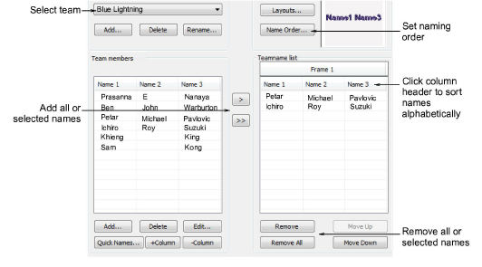
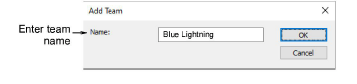
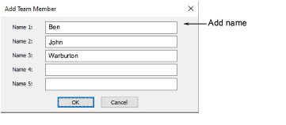
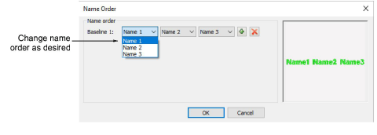
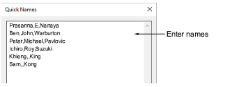

# Teamname setup

The Team Names dialog lets you create/rename/remove groups and edit names in groups.

The Add Team dialog lets you enter a name for a team lettering group.

The Add Team Member dialog lets you add members to a team lettering group one-by-one.

Use this option, for example, if you want to put surnames before first and second names. You can also use this dialog to limit which names are included – e.g only first and third names.

The Quick Names dialog lets you add multiple member names to a team lettering group.

## Related topics

- [Creating simple teamname designs](../../Lettering/lettering_names/Creating_simple_teamname_designs)
- [Managing teams](../../Lettering/lettering_names/Managing_teams)
